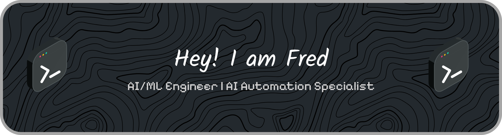

  

---

## 🧠 About Me

- 🤖 Building AI-powered applications using **LLMs, RAG pipelines, agents, and workflow automation**
- 🐍 Python-first developer focused on turning AI capabilities into practical, user-facing products
- 🚀 Passionate about **AI Engineering** — from prompt orchestration and retrieval systems to production-ready APIs
- 🔄 Experienced in automating business workflows with **n8n, and AI agents**
- 🌱 Currently exploring **agentic systems, voice AI, local LLMs, and AI infrastructure**
- 📦 I enjoy shipping projects end-to-end using **FastAPI, Docker, vector databases, and modern AI tooling**
- 🎯 My goal is to build intelligent systems that solve real-world problems and improve how people work

---

## 🛠️ Tech Stack

### 🤖 AI / ML

  
  
  
  
  
  

### 📊 Data

  
  
  
  

### 🗄️ Vector & Storage

  
  

### 🌐 Backend & APIs

  

### 🔄 Automation & Workflows

  

### ⚙️ DevOps & Environment

  
  

---

  <i>Open to AI/ML engineering roles and collaborations. Let's build something!</i>

